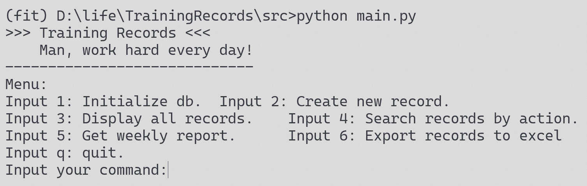

# TrainingRecords	

出于个人健身的需要，开发一个轻量的app记录每日训练内容。
目标：记录个人每日运动状况，兼具数据统计分析功能.

## Table of Contents
- [Background](#Background)
- [Install](#Install)
- [Usage](#Usage)
- [Development plan](#Development plan)

## Background
2021的下半年开始进行“老年复健”，半年来的训练记录只简单的储存在未固定格式的表格中，致使年终难有效统计回顾个人运动记录。

新年伊始，运动要继续。恰逢寒假间隙，索性依照个人需求，定制一款运动记录管理的小软件。愿2022能不秃头，也变强💪。

## Install
Clone the source code by
`git clone https://github.com/vincentX3/TrainingRecords.git`

Required packages please see requirements.txt.

## Usage

- v0 - Command Line UI

  `python ./src/main.py`

  Follow the instructions to keep your records.

  

- v1 - Graphic UI

  `python ./src/ui_main.py`

  Screenshots:
  
  
  
  

## Development plan
v0:
- [x] Command LineUI
- [x] record today trainings
- [x] display all records
- [x] search records by action
- [x] export to excel
- [x] weekly report

v1:
- [x] GUI
  - [x] home page
    - [x] new record
    - [x] todo list
  - [x] history page
    - [x] deletion / update records
  - [x] beautify UI
    - [x] change layout
    - [x] add icon
    - [x] qss

v2:
- [ ] Excel Import & Export

- [ ] analysis page
  - [ ] data visualization
  - [ ] weekly report
  
- [ ] release software

  

Future:
可能转向web app？微信小程序？

